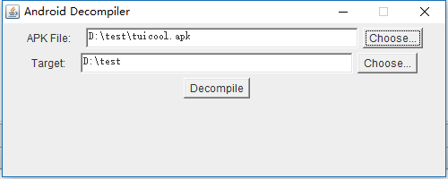

A GUI wrapper for [apktool](http://ibotpeaches.github.io/Apktool/) and [dex2jar](https://github.com/pxb1988/dex2jar)

**Screenshot**

Choose the apk file and the corresponding res and classes.jar file will generated in the target path.

Download the executable jar file [link](https://raw.githubusercontent.com/CloudHuang/AndroidDecompiler/master/AndroidDecompiler.jar)
